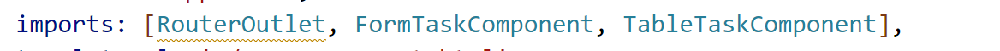

# Práctica 1. Aplicación "Administrador de tareas en Angular"

En esta práctica se espera que el alumno pueda implementar una aplicación de "Gestión de tareas" en Angular usando los conceptos básicos de este Framework. 


## Objetivos de la práctica:
- Construir un proyecto de Angular.
- Crear componentes.
- Crear servicios.
- Iniciar proyecto de Angular.

## Duración aproximada:
- 45 minutos.
---
<!--Este fragmento es la barra de 
navegación-->

<div style="width: 400px;">
        <table width="50%">
            <tr>
                <td style="text-align: center;">
                    <a href=""></a>
                    <br>anterior
                </td>
                <td style="text-align: center;">
                   <a href="../README.md">Lista Laboratorios</a>
                </td>
<td style="text-align: center;">
                    <a href="../Capitulo2/"></a>
                    <br>siguiente
                </td>
            </tr>
        </table>
</div>

---

## Aplicación 
Se espera que el alumno implemente la siguiente aplicación:


## Instrucciones 
Paso 1. Abre una nueva terminal de Windows.

Paso 2. Navega al escritorio de la máquina y ejecuta el siguiente comando. 
- **stylesheet:** CSS
- **Server-Side Rendering (SSR):** No

```bash
ng new taskmanager
```


Paso 3. Abre el proyecto en **Visual Studio Code.**


Paso 4. Abre en **VSCode** una terminal y crea 2 componentes con los siguientes comandos:

```bash
ng generate component components/form-task --skip-tests
```

```bash
ng generate component components/table-task --skip-tests 
```

> **NOTA:** Los comandos anteriores crearán 2 componentes. 

Paso 5. Crea un servicio con el siguiente comando: 

```bash
ng generate service services/Task --skip-tests
```
Paso 6. En el archivo **index.html** agregaremos bootstrap. Puedes navegar en la siguiente ruta (https://getbootstrap.com/), en este caso en particular agrega bootstrap por CDN. Nuestro **index.html** quedará de la siguiente forma: 

```html
<!doctype html>
<html lang="en">
<head>
  <meta charset="utf-8">
  <title>Taskmanager</title>
  <base href="/">
  <meta name="viewport" content="width=device-width, initial-scale=1">
  <link rel="icon" type="image/x-icon" href="favicon.ico">

  <!--link bootstrap-->
  <link href="https://cdn.jsdelivr.net/npm/bootstrap@5.3.6/dist/css/bootstrap.min.css" rel="stylesheet" integrity="sha384-4Q6Gf2aSP4eDXB8Miphtr37CMZZQ5oXLH2yaXMJ2w8e2ZtHTl7GptT4jmndRuHDT" crossorigin="anonymous">
</head>
<body>
  <app-root></app-root>

  <!--Script bootstrap-->
  <script src="https://cdn.jsdelivr.net/npm/bootstrap@5.3.6/dist/js/bootstrap.bundle.min.js" integrity="sha384-j1CDi7MgGQ12Z7Qab0qlWQ/Qqz24Gc6BM0thvEMVjHnfYGF0rmFCozFSxQBxwHKO" crossorigin="anonymous"></script>
</body>
</html>
```

 Paso 7. Crea una carpeta en **app**, con el nombre de **entities**.


Paso 8. Dentro de la carpeta **entities** crea un archivo llamado **business.ts**.  


Paso 9. En el archivo **business.ts** añade el siguiente código:

```typescript
export enum Priority{
    HIGH="alta",MEDIUM="media",LOW="baja"
}

export interface TaskUser{
    id:number,
    name:string,
    priority:Priority,
    description:string,
    done:boolean
}
```

Paso 10. En el archivo **app->services->task.service.ts**, modifica su código con lo siguiente:

```typescript
import { Injectable } from '@angular/core';
import { TaskUser } from '../entities/business';


@Injectable({
  providedIn: 'root'
})
export class TaskService {
  private tasks:TaskUser[];
  idTasks=0;
  constructor() { 
    this.tasks=[];
  }

  getTasks(){
    return this.tasks;
  }

  addTask(task:TaskUser){
    if(this.tasks.length === 0){
      this.idTasks=0;
    }
    task.id=++this.idTasks;
    console.log(this.tasks);
    this.tasks.push(task);
  }
  removeTask(id:number){
     const index= this.tasks.findIndex(t=>t.id === id);
     if(index !== -1){
        this.tasks.splice(index, 1);
     }
  }
}
```

Paso 11. En el **html** del componente llamado **form-task.component.html** añade el siguiente código:

```html
<div class="container-fluid" >
    <h3>Formulario tareas</h3>
    <form [formGroup]="form" class="form" (ngSubmit)="handleSubmit()">
        <div class="mb-3">
            <h5>Nombre</h5>
            <input  type="text" name="nameTask" formControlName="name" >
           @if (form.controls.name.hasError('pattern') && 
                form.controls.name.hasError('required')) {
               <div>
                <h6>se permite una cadena con longitud 2 a 20</h6>
               </div>
           }
        </div>

        <div class="mb-3">
            <h5>Prioridad</h5>
            <input type="radio" [value]="priorityEnum.LOW" formControlName="priority" name="priority">  baja 
            <input type="radio" [value]="priorityEnum.MEDIUM" formControlName="priority" name="priority"> media
            <input type="radio" [value]="priorityEnum.HIGH" formControlName="priority" name="priority"> alta
        </div>

        <div class="mb-3">
           <h5>Descripción</h5>
           <textarea name="description" formControlName="description"></textarea>
           @if (form.controls.description.hasError('pattern') &&
                form.controls.description.hasError('required')) {
               <div>
                 <h6>se permite una cadena con longitud 2 a 100</h6>
               </div>
           }
        </div>
     
        <button type="submit" class="btn bg-primary" style="color: aliceblue;">Salvar</button>
    </form>
</div>
```

Paso 12. En el archivo **form-task.component.ts** añade el siguiente código: 

```typescript
import { Component } from '@angular/core';
import { Priority, TaskUser } from '../../entities/business';
import { FormControl, FormGroup, ReactiveFormsModule, Validators } from '@angular/forms';
import { TaskService } from '../../services/task.service';

@Component({
  selector: 'app-form-task',
  imports: [ReactiveFormsModule],
  templateUrl: './form-task.component.html',
  styleUrl: './form-task.component.css'
})
export class FormTaskComponent {
priorityEnum= Priority;  

    form= new FormGroup({
     name: new FormControl<string>(
      '', 
      [Validators.pattern(/^[a-zA-Z\s]{2,20}/),
      Validators.required]
    ),
     priority:new FormControl<Priority>(this.priorityEnum.MEDIUM),
     description: new FormControl<string>('', 
      [Validators.pattern(/.{2,100}/),
      Validators.required]
    )
  });

  constructor(private service:TaskService){}


  handleSubmit(){
     if(!this.form.controls.name.hasError('pattern') && 
     !this.form.controls.name.hasError('required') &&
     !this.form.controls.description.hasError('pattern')&&
     !this.form.controls.description.hasError('required')){
        let task:TaskUser = {
          name:this.form.controls.name.value!,
          description:this.form.controls.description.value!,
          priority:this.form.controls.priority.value!,
          id: 0,
          done: false
        }
        this.service.addTask(task);
        console.log(this.service.getTasks());
     }else{
      console.log("algo esta fallando")
     }    
  }
}
```

Paso 13. En el componente **table-task.component.html** añade el siguiente código:

```html
<div class="container-fluid">
  <table class="table table-stripped">
    <thead>
        <tr>
            <th scope="col">id</th>
            <th scope="col">nombre</th>
            <th scope="col">descripción</th>
            <th scope="col">prioridad</th>
            <th scope="col">realizada</th>
        </tr>
    </thead>

    <tbody class="table-group-divider">
        @for (item of tasks; track $index) {
            <tr>
             <td>{{item.id}}</td>
             <td>{{item.name}}</td>
             <td>{{item.description}}</td>
             <td>{{item.priority}}</td>
             <td><input type="checkbox" [checked]="item.done" (change)="item.done = !item.done"></td>  
             <td>
                <button class="btn btn-danger" (click)="deleteTask(item.id)" >delete</button>
             </td>
            </tr>
        }
  
    </tbody>
  </table>
</div>
```

Paso 14. En el archivo **table-task.component.ts** añade el siguiente código: 

```typescript
import { Component } from '@angular/core';
import { TaskUser } from '../../entities/business';
import { TaskService } from '../../services/task.service';

@Component({
  selector: 'app-table-task',
  imports: [],
  templateUrl: './table-task.component.html',
  styleUrl: './table-task.component.css'
})
export class TableTaskComponent {
  tasks:TaskUser[];

  constructor(private service:TaskService){
     this.tasks=service.getTasks();
  }
  
  deleteTask(id:number){
     this.service.removeTask(id);
  }
}

```

Paso 15. En el componente principal **app.component.html** añade el siguiente código:

```html
<nav class="navbar bg-primary">
    <a class="navbar-brand" style="color: aliceblue;">Task Manager</a>
</nav>

<br>
<div class="container">
  <div class="row">
    <div class="col-6">
      <app-form-task></app-form-task>
    </div>

    <div class="col-4">
      <app-table-task></app-table-task>
    </div>
  </div>
  
</div>
```

> **IMPORTANTE:** Hay que asegurarse de que se hayan importado los 2 componentes en el componente principal del archivo **app.component.ts**




# Resultado esperado
Si se ha llegado hasta este punto se debe de iniciar la aplicación con el siguiente comando:

```bash
ng serve
```

- Abrir el siguiente URL: http://localhost:4200/


