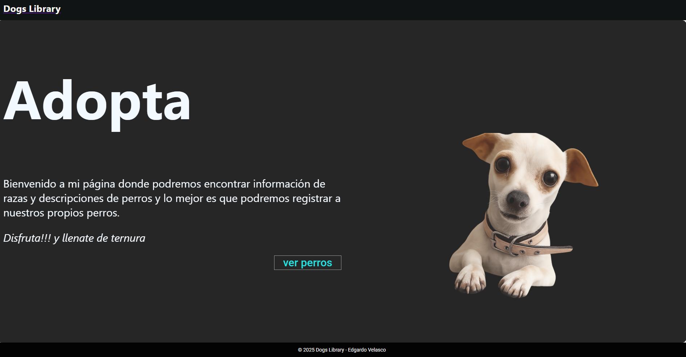
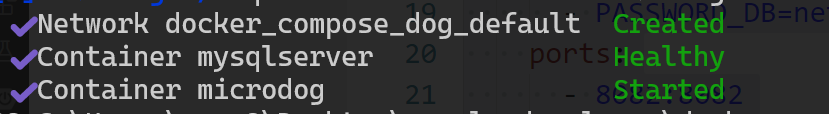
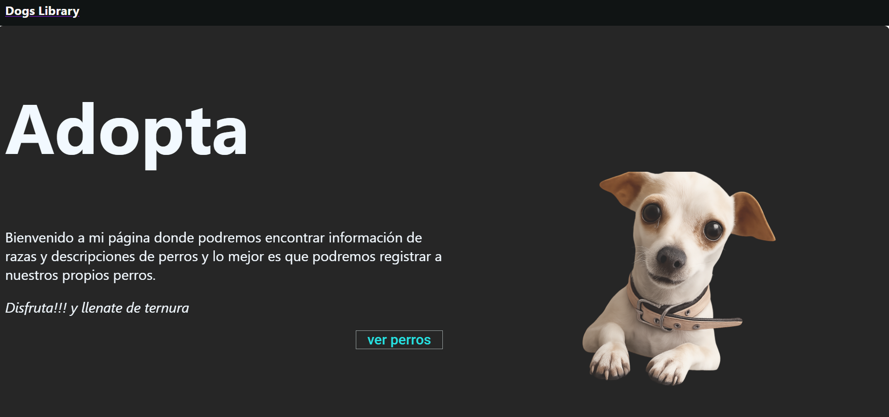
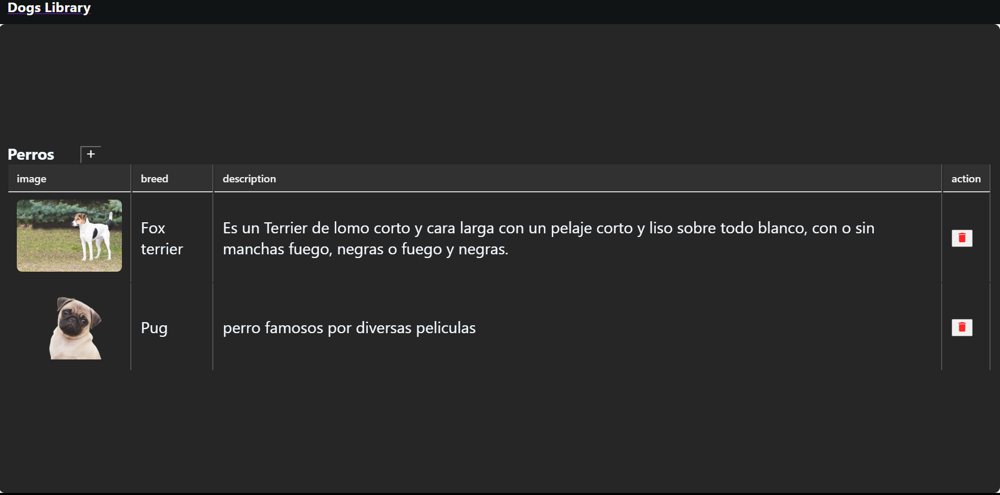
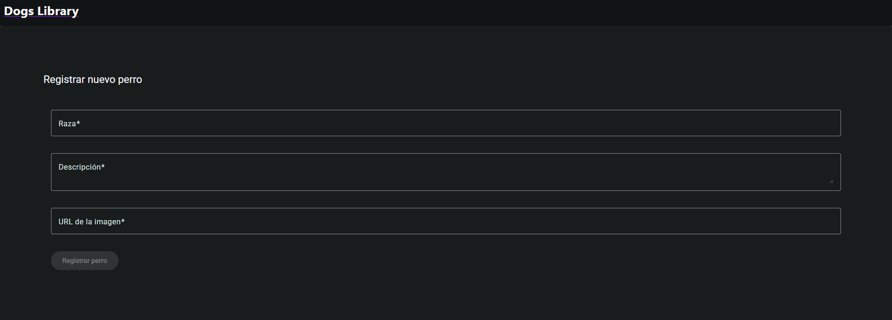

# Práctica 2. Aplicación "Dog Library"
En esta práctica, usando los conceptos de las últimas versiones de Angular, se implementa una aplicación de administración de perros.


## Objetivos de la práctica:
- Usar formularios reactivos.
- Injectar servicios usando el método **inject()**.
- Diseñar la interface usando **Angular Material**.

## Duración aproximada:
- 60 minutos.

---
<div style="width: 400px;">
        <table width="50%">
            <tr>
                <td style="text-align: center;">
                    <a href="../Capitulo1/"></a>
                    <br>anterior
                </td>
                <td style="text-align: center;">
                   <a href="../README.md">Lista Laboratorios</a>
                </td>
<td style="text-align: center;">
                    <a href="../Capitulo3/" width="40px">
                    </a>
                    <br>siguiente
                </td>
            </tr>
        </table>
</div>

---

## Diagrama
### Al finalizar la práctica, se espera que el alumno tenga una aplicación similar a la siguiente:



<br>


## Instrucciones
Esta práctica se encuentra dividida en las siguientes secciones: 

- **[Docker Compose Api Dogs]()**
- **[Aplicación en Angular]()**

## Docker compose API Dogs [return](#instrucciones)

> **IMPORTANTE:** Para implementar esta sección se debe de tener instalado **Docker** en tu computadora.

Paso 1. Crea una carpeta en el escritorio con el nombre de **DogAPI**.

Paso 2. Dentro de la carpeta **DogAPI** genera un archivo llamado **docker-compose.yaml**.

Paso 3. En el archivo **docker-compose.yaml** añade el siguiente contenido: 

```yaml
services:
  mysqlserver:
    container_name: mysqlserver
    image: "mysql:8.0"
    environment:
      - MYSQL_ROOT_PASSWORD=netec123
      - MYSQL_DATABASE=dogs
    healthcheck:
      test: mysqladmin ping -uroot -p${MYSQL_ROOT_PASSWORD} -hlocalhost
  
  microdog:
    container_name: microdog
    image: edgardovefe/angulardev:microservicedog
    environment:
      - IP_DB=mysqlserver
      - PORT_DB=3306
      - NAME_DB=dogs
      - USER_DB=root
      - PASSWORD_DB=netec123
    ports:
      - 8082:8082
    depends_on:
      mysqlserver:
        condition: service_healthy

```

Paso 4. Abre una terminal de Windows dentro de la carpeta **DogAPI** y ejecuta el siguiente comando: 

```bash
docker-compose up -d
```

> **NOTA:** El comando tardará un poco en iniciar. Este comando pone en marcha un microservicio en el puerto 8082.




Paso 5. Abre **INSOMNIA ó POSTMAN**  para probar el api. Inserta 2 Perros y obtenlos con el siguiente comando:

- **POST**: Insertar perro
```bash
curl --request POST \
  --url http://localhost:8082/dog \
  --header 'Content-Type: application/json'\
  --data '{
	"breed":"Fox terrier",
	"description":"Es un Terrier de lomo corto y cara larga con un pelaje corto y liso sobre todo blanco, con o sin manchas fuego, negras o fuego y negras.",
"urlImage":"https://www.zooplus.es/magazine/wp-content/uploads/2022/05/Fox-terrier-de-pelo-liso.jpeg"
	
}'
```

- **GET**: Obtener los perros

```bash
curl --request GET \
  --url http://localhost:8082/dog
```


## Aplicación en Angular [return](#instrucciones)

Paso 1. Abre una terminal en el escritorio y ejecuta el siguiente comando:

```bash
ng new dogs-library
```
- **stylesheet:** CSS
- **Server Side Rendering:** No


Paso 2. Abre la aplicación en **Visual Studio Code**.

Paso 3. En la carpeta **src->app** crea una carpeta con el nombre de **entities**.

Paso 4. Dentro de la carpeta **entities** genera un archivo con el nombre de **business.ts**; y añade el siguiente contenido: 

```typescript
export interface Dog{
    id:number,
    breed:String,
    description:String,
    urlImage:String
}
```

Paso 5. Abre una terminal en **Visual Studio Code**.

Paso 6. Crea un **servicio** usando el siguiente comando: 

```bash
ng generate service services/dog --skip-tests
```

Paso 7. En el **servicio** generado añadiremos el siguiente contenido: 

```typescript
import { HttpClient } from '@angular/common/http';
import { Injectable } from '@angular/core';
import { catchError, map, Observable, throwError, timeout } from 'rxjs';
import { Dog } from '../entities/business';

@Injectable({
  providedIn: 'root'
})
export class DogService {
  private urlBase:string="http://localhost:8082/dog"

  constructor(private http:HttpClient) { }

  getDogs():Observable<Dog[]>{
     return this.http.get<any[]>(this.urlBase)
        .pipe(timeout(3000), map(json=>json.map(
          dog=>dog as Dog
        )))
  }

  addDog(dog:Dog):Observable<void>{
      return this.http.post<void>(this.urlBase, dog)
             .pipe(timeout(3000), 
             catchError(err=>{
               console.log('Error al insertar ', err);
               return throwError(()=>new Error("no se pudo insertar"));
             }));
  }

  deleteDog(id:number):Observable<void>{
     return this.http.delete<void>(`${this.urlBase}/${id}`)
     .pipe(timeout(3000), 
    catchError((error)=>{
      console.log("error al eliminar", error);
      throw new Error("error al eliminar");
    }));
  }
}
```

Paso 7.1. **NO OLVIDES agregar el HttpProvider** en el archivo **app.config.ts**: 

```typescript
import { ApplicationConfig, provideZoneChangeDetection } from '@angular/core';
import { provideRouter } from '@angular/router';

import { routes } from './app.routes';

/*se tiene que agregar parar usar HttpClient */
import { provideHttpClient } from '@angular/common/http'


export const appConfig: ApplicationConfig = {
  providers: [
    provideZoneChangeDetection({ eventCoalescing: true }),
    provideRouter(routes),
    provideHttpClient()
  ]
};
```

Paso 8. Utilizando la terminal, añade **Angular Material** usando el siguiente comando:

```bash
ng add @angular/material@19.2.16
```
Se te realizaran las siguientes preguntas:

- **Confirmación de instalación:** Yes.
- **Tema a utilizar:** Cyan/Orange (aunque puedes elegir el que más te guste).
- **Set up global Angular Material typography styles?**: Yes.


Paso 9. Crea 3 componentes con los siguientes comandos:

```bash
ng generate component components/home --skip-tests
```

```bash
ng generate component components/dog-form --skip-tests
```

```bash
ng generate component components/dog-table --skip-tests
```

Paso 10. Configura el archivo de **rutas** **app.routes.ts** y añade las siguientes rutas: 

```typescript
import { Routes } from '@angular/router';
import { HomeComponent } from './components/home/home.component';
import { DogTableComponent } from './components/dog-table/dog-table.component';
import { DogFormComponent } from './components/dog-form/dog-form.component';

export const routes: Routes = [
    {path:'', component:HomeComponent},
    {path:'dogs', component:DogTableComponent},
    {path:'add',component:DogFormComponent}
];
```

Paso 11. Configura el componente principal **app.component.ts** e importa **MatToolBarModule, RouterLink, RouterOutlet**, debería quedar de la siguiente manera: 

```typescript
import { Component } from '@angular/core';
import { RouterLink, RouterOutlet } from '@angular/router';
import { MatToolbarModule } from '@angular/material/toolbar';


@Component({
  selector: 'app-root',
  imports: [MatToolbarModule, RouterLink, RouterOutlet],
  templateUrl: './app.component.html',
  styleUrl: './app.component.css'
})
export class AppComponent {
  title = 'dogapp';

}
```

Paso 12. Ahora, modifica el **app.component.html** con el siguiente contenido: 

```html
<mat-toolbar>
  <a routerLink="/"><span class="title">Dogs Library</span></a>
</mat-toolbar>

<router-outlet></router-outlet>

<footer class="footer">
    <span>© 2025 Dogs Library - Edgardo Velasco</span>
</footer>

```

Paso 13. Añade el siguiente **app.component.css** para darle estilo a nuestros componentes: 

```css
.title{
    color: #fcf9f9;
    font-family: 'Segoe UI', Tahoma, Geneva, Verdana, sans-serif;
    font-weight: bold;
    font-size: larger;
}


.footer {
  background-color: #030303;
  color: white;
  text-align: center;
  padding: 12px 0;
  font-size: 14px;
}

```


Paso 14. Configurando el componente **Home**.
         Primero, añade las siguientes importaciones en el **home.component.ts**: 

```typescript
import { Component, inject } from '@angular/core';
import {MatCardModule} from '@angular/material/card';
import {MatGridListModule} from '@angular/material/grid-list';
import {MatButtonModule} from '@angular/material/button';
import { RouterLink } from '@angular/router';

@Component({
  selector: 'app-home',
  imports: [MatButtonModule, MatGridListModule, MatCardModule, RouterLink],
  templateUrl: './home.component.html',
  styleUrl: './home.component.css'
})
export class HomeComponent {

}
```

Paso 15. Añade en el **html** del componente **Home** (archivo **home.component.html**) el siguiente contenido: 

```html
<mat-card class="fullscreen-card">

  <mat-card-header class="cardtitle">
    <span>Adopta</span>
  </mat-card-header>

  <mat-card-content>
    <mat-grid-list cols="2" rowHeight="2:1">

      <mat-grid-tile>
        <div style="width: 100%;">
          <p class="cardbody">Bienvenido a mi página donde podremos encontrar
            información de razas y descripciones de perros y lo mejor es que podremos
            registrar a nuestros propios perros. 
          </p>
          <p class="cardbody">
            <span style="font-style: italic;">Disfruta!!! y llenate de ternura </span>
          </p>

          <button class="btn" mat-stroked-button routerLink="/dogs">ver perros</button>
        </div>
        
        
      </mat-grid-tile>

      <mat-grid-tile>
        
      </mat-grid-tile>
    </mat-grid-list> 
  </mat-card-content>

</mat-card>
```
Paso 16. Añade en el **CSS** del componente **Home** los estilos que usaremos (archivo **home.component.css**).

```css
.cardtitle{
    color: aliceblue;
    font-family: 'Segoe UI', Tahoma, Geneva, Verdana, sans-serif;
    font-weight: bolder;
    font-size: 150px;
}

.cardbody{
    color: aliceblue;
    font-family: 'Segoe UI', Tahoma, Geneva, Verdana, sans-serif;
    font-size: 30px;
}
.fullscreen-card {
  flex: 1;
  display: flex;
  justify-content: center; 
  height: 90%;
  background-color: black;
  opacity: 0.85;
}

.btn{
    font-size: 30px;
    margin-left: 80%;
    border-radius: 0;
}
```

Paso 17. Ahora se modificará el contenido del componente **dog-table**. Añade el siguiente código en el **dog-table.component.ts**.

```typescript
import { Component, inject, signal } from '@angular/core';
import { Dog } from '../../entities/business';
import { DogService } from '../../services/dog.service';
import {MatCardModule} from '@angular/material/card';
import {MatIconModule} from '@angular/material/icon';
import { RouterLink } from '@angular/router';


@Component({
  selector: 'app-dog-table',
  imports: [MatCardModule, MatIconModule, RouterLink],
  templateUrl: './dog-table.component.html',
  styleUrl: './dog-table.component.css'
})
export class DogTableComponent {
  private service:DogService = inject(DogService);
  dogs=signal<Dog[]>([{
    id:0,
    breed:"pug", 
    description:"perro muy famoso por la pelicula 'Hombres de negro'",
    urlImage:"https://storagevefe.blob.core.windows.net/angulardeveloper/pug.png"
  }]);

  ngOnInit(){
    this.service.getDogs().subscribe({next:value=>{this.dogs.set(value)}})
  }

  deleteDog(id:number){
    this.service.deleteDog(id).subscribe({
      error:error=>{console.log(error)},
      next:()=>{
        const updated= this.dogs().filter(d=>d.id !== id);
        this.dogs.set(updated);
      }
    });
  }
}
```

Paso 18. Modifica el **Html** del componente **dog-table**.

```html
<mat-card class="fullscreen-card">
    <mat-card-header>
       <mat-card-title class="cardtitle">Perros</mat-card-title>
       <button style="margin-left: 50px; color: white; background-color: black;" routerLink="/add"><mat-icon>add</mat-icon></button>
    </mat-card-header>
    
    <mat-card-content class="cardbody">
       <table>
        <thead>
            <tr>
                <th>image</th>
                <th>breed</th>
                <th>description</th>
                <th>action</th>
            </tr>
        </thead>
        <tbody>
            @for (dog of dogs(); track $index) {
               <tr>
                <td>
                    
                </td>
                <td>{{dog.breed}}</td>
                <td>{{dog.description}}</td>
                <td>
                    <div>
                        <button (click)="deleteDog(dog.id)">
                            <mat-icon style="color: red;">delete</mat-icon>
                        </button>
                    </div>
                </td>
               </tr>
            }
        </tbody>
       </table>
    
    
    </mat-card-content>
</mat-card>
```

Paso 19. Modifica el **CSS** del component **dog-table** con el siguiente contenido: 

```css
.cardtitle{
    color: aliceblue;
    font-family: 'Segoe UI', Tahoma, Geneva, Verdana, sans-serif;
    font-weight: bolder;
    font-size: 30px;
}

.cardbody{
    color: aliceblue;
    font-family: 'Segoe UI', Tahoma, Geneva, Verdana, sans-serif;
    font-size: 30px;
    overflow: auto;
}
.fullscreen-card {
  flex: 1;
  display: flex;
  justify-content: center; 
  height: 90%;
  background-color: black;
  opacity: 0.85;
}


table {
  width: 100%;
  font-family: 'Segoe UI', Tahoma, Geneva, Verdana, sans-serif;
}

th, td {
  padding: 12px 16px;
  text-align: left;
  border-right: 2px solid #353333;
}

th {
  background-color: #0e0d0d;
  color: #f1efef;
  font-weight: 600;
  font-size: 20px;
  border-bottom: 2px solid #d0d0d0;
}


img {
  border-radius: 10px;
}
```

Paso 20. Modifica el **typescript** del componente **dog-form** añadiendo el siguiente contenido: 

```typescript
import { Component, inject } from '@angular/core';
import { MatCardModule } from '@angular/material/card';
import { FormControl, FormGroup, ReactiveFormsModule, Validators } from '@angular/forms'
import { MatInputModule } from '@angular/material/input';
import { MatFormFieldModule } from '@angular/material/form-field';
import { MatButtonModule } from '@angular/material/button';
import { Dog } from '../../entities/business';
import { DogService } from '../../services/dog.service';
import { Router } from '@angular/router';


@Component({
  selector: 'app-dog-form',
  imports: [MatCardModule, 
    ReactiveFormsModule, 
    MatInputModule, 
    MatFormFieldModule,
    MatButtonModule
  ],
  templateUrl: './dog-form.component.html',
  styleUrl: './dog-form.component.css'
})
export class DogFormComponent {
  private service:DogService=inject(DogService);
  private router:Router=inject(Router);


  form=new FormGroup({
    breed: new FormControl<string>('',[
      Validators.pattern(/^[a-z,A-Z,\s]/), 
      Validators.required,
      Validators.maxLength(20)
    ]),
    description: new FormControl<String>('', [
      Validators.pattern(/^[a-z,A-Z,\s]/), 
      Validators.required,
      Validators.maxLength(150)
    ]),
    urlImage: new FormControl<String>('',[
      Validators.pattern(/^https?:\/\/[^\s]+?\.(jpg|jpeg|png)$/), 
      Validators.required,
      Validators.maxLength(150)
    ])
});


submit(){
  let breed=this.form.controls.breed.value!
  let description=this.form.controls.description.value!
  let urlImage=this.form.controls.urlImage.value!

  let dog:Dog={
    id:0,
    breed:breed,
    description:description,
    urlImage:urlImage
  }

  this.service.addDog(dog).subscribe({
    next:value=>{
      this.router.navigate(['dogs']);
    },
    error:error=>{console.log(error)}
  }); 
}


}
```

Paso 21. Modifica el **html** del componente **dog-form** usando el siguiente contenido: 

```html

<mat-card>
  <mat-card-title style="margin-bottom: 50px; color: aliceblue;">Registrar nuevo perro</mat-card-title>
  <mat-card-content>
    <form [formGroup]="form" (ngSubmit)="submit()">

      <mat-form-field appearance="outline" class="full-width">
        <mat-label>Raza</mat-label>
        <input matInput formControlName="breed" placeholder="Ej. Labrador">
      </mat-form-field>

      <mat-form-field appearance="outline" class="full-width">
        <mat-label>Descripción</mat-label>
        <textarea matInput formControlName="description" placeholder="Describe al perro"></textarea>
      </mat-form-field>

      <mat-form-field appearance="outline" class="full-width">
        <mat-label>URL de la imagen</mat-label>
        <input matInput formControlName="urlImage" placeholder="https://...">
      </mat-form-field>

      <button mat-raised-button color="primary" type="submit" [disabled]="form.invalid">
        Registrar perro
      </button>
    </form>
  </mat-card-content>
</mat-card>
```

Paso 22. Modifica el **CSS** del componente **dog-form** con el siguiente contenido: 

```css
.full-width {
  width: 100%;
  margin-bottom: 16px;
}

mat-card {
  height: 90%;
  padding: 100px;
}
```

Paso 23. Inicia la aplicación con el siguiente comando: 

```bash
ng serve --port=500
```

> **NOTA**: El argumento --port sólo se usa si quieres modifica el puerto donde inicia la aplicación. 


## Resultado esperado

Si se ha llegado hasta aqui se debería de observar la aplicación con las siguientes pantallas: 




