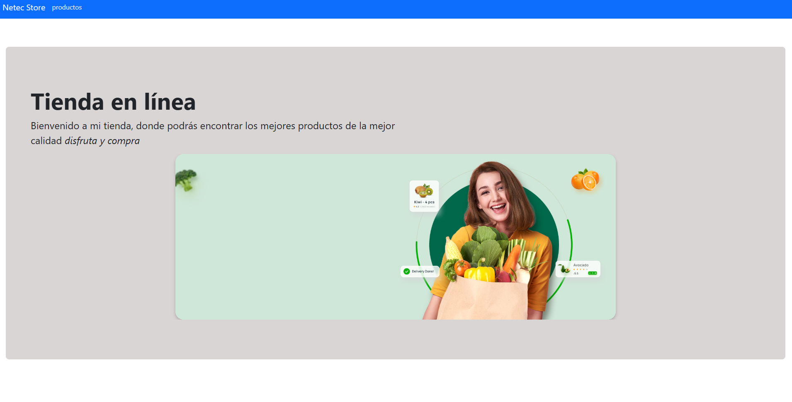
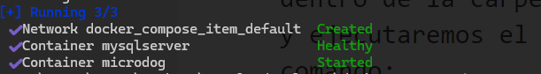
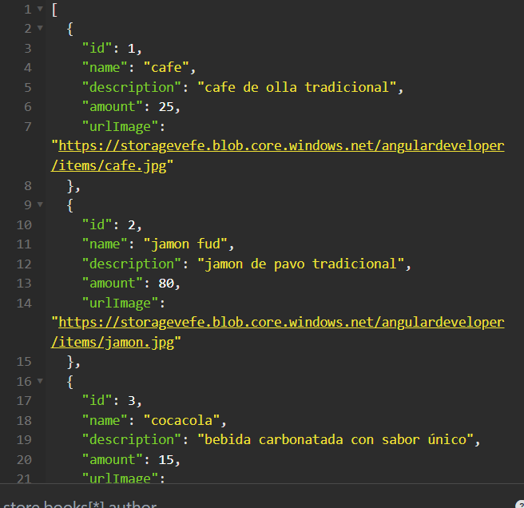
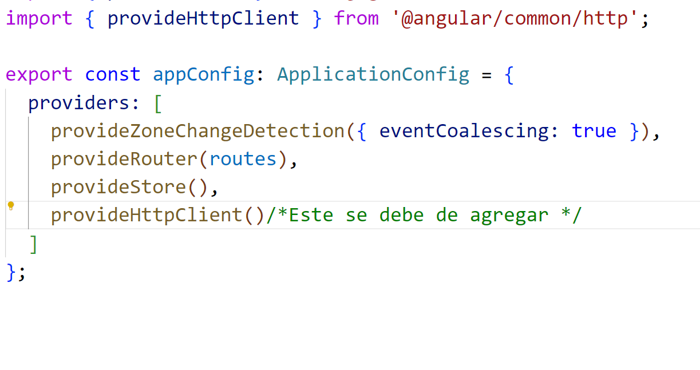
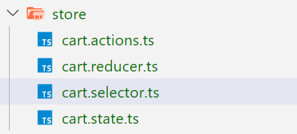
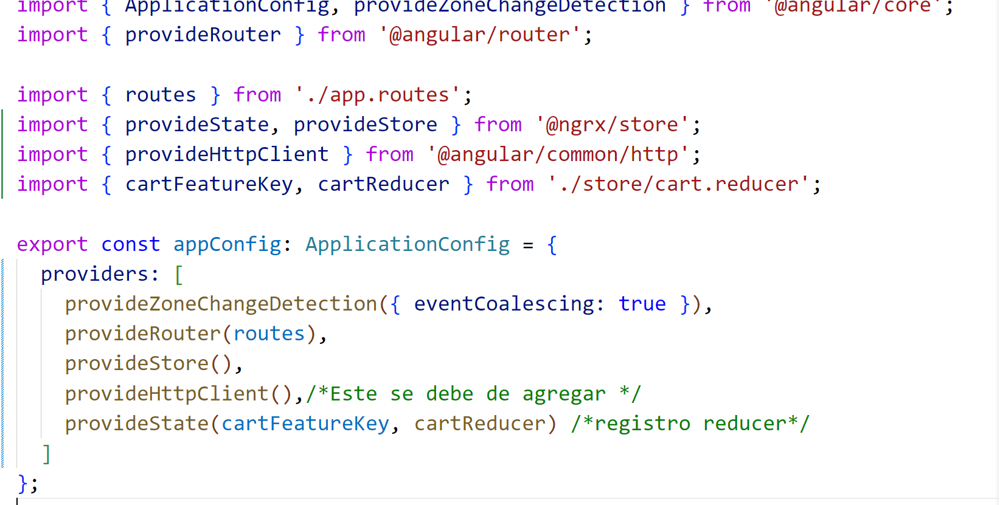
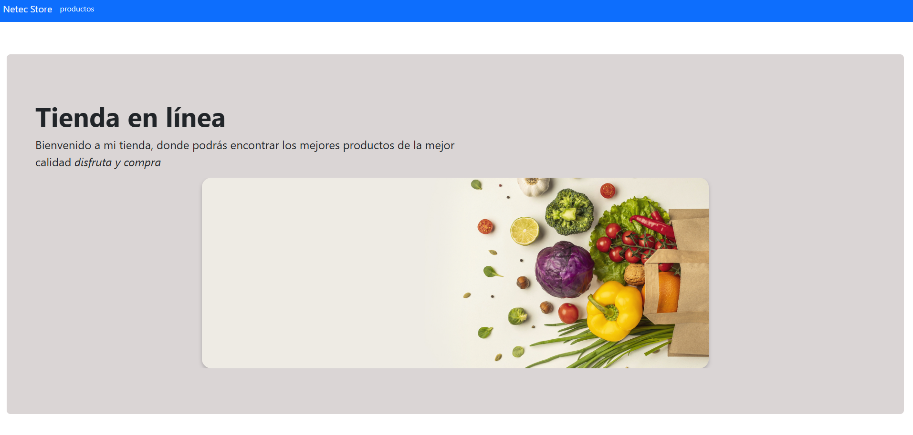
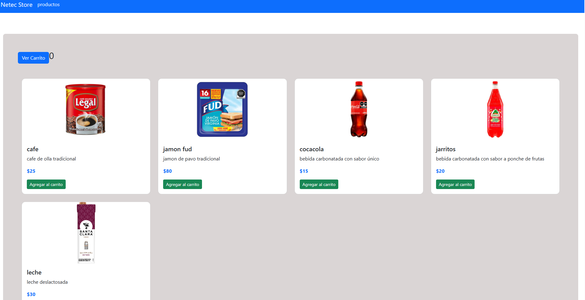
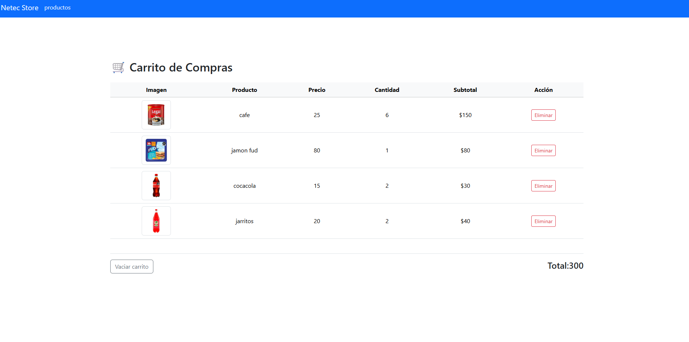

# Práctica 3. Aplicación "ShoppingCart Angular"
En esta práctica se espera que el alumno pueda implementar una aplicación capaz de comunicarse a un API Rest de Spring para mostrar productos y con esto, pueda generar un carrito de compras que permita registrar los productos de su interés. 

## Objetivos
- Desplegar API RESTful usando docker-compose.
- Crear una aplicación en Angular.
- Conectarse y renderizar los productos en un componente.
- Usar **ngrx** para manejar el estado del carrito de compras.


---

<div style="width: 400px;">
        <table width="50%">
            <tr>
                <td style="text-align: center;">
                    <a href="../Capitulo2/"></a>
                    <br>anterior
                </td>
                <td style="text-align: center;">
                   <a href="../README.md">Lista Laboratorios</a>
                </td>
<td style="text-align: center;">
                    <a href="../Capitulo4/"></a>
                    <br>siguiente
                </td>
            </tr>
        </table>
</div>

---


## Diagrama
Al final de la práctica se espera que el alumno pueda observar una aplicación cómo la siguiente: 





## Instrucciones
Esta práctica se encuentra dividida en las siguientes secciones: 

- **[Despliegue API Spring](#despliegue-api-spring-return)**
- **[Crear Angular App](#crear-angular-app-return)**

## Despliegue API Spring [return](#instrucciones)

> **IMPORTANTE:** Para realizar correctamente esta sección es importante que se tenga instalado **Docker**.

1. En el escritorio crea una carpeta con el nombre de **deployItem**.

2. En la carpeta **deployItem** genera un archivo al que llamaremos **docker-compose.yaml**. 

3. En el archivo **docker-compose.yaml** añade el siguiente contenido: 

```yaml
services:
  mysqlserver:
    container_name: mysqlserver
    image: "mysql:8.0"
    environment:
      - MYSQL_ROOT_PASSWORD=netec123
      - MYSQL_DATABASE=items
    healthcheck:
      test: mysqladmin ping -uroot -p${MYSQL_ROOT_PASSWORD} -hlocalhost
  
  microdog:
    container_name: microdog
    image: edgardovefe/angulardev:microserviceitem
    environment:
      - IP_DB=mysqlserver
      - PORT_DB=3306
      - NAME_DB=items
      - USER_DB=root
      - PASSWORD_DB=netec123
    ports:
      - 8083:8083
    depends_on:
      mysqlserver:
        condition: service_healthy
```

4. Abre una terminal dentro de la carpeta **deployItem** y ejecuta el siguiente comando: 

```bash
docker-compose up -d
```

> **NOTA**: Este comando tardará unos minutos en ejecutarse. Al final debería de observar lo siguiente: 



5. Prueba el **API** usando **POSTMAN / INSONMIA**, usa el siguiente request:

- **GET** (obtiene todos los productos):

```bash
curl --request GET \
  --url http://localhost:8083/item
```




## Crear Angular App [return](#instrucciones)

1. Abre una nueva terminal en el escritorio. 
2. Ejecuta el siguiente comando estando en el escritorio:

```bash
ng new shop
```

- **Stylesheet:** CSS
- **Server-Side Rendering:** SSR

3. Abre el proyecto en **Visual Studio Code**.

4. Abre la terminal de **Visual Studio Code** e instala **NGRX** usando el siguiente comando (*usaremos la versión 19 porque usamos angular 19*): 

```bash
ng add @ngrx/store@19.2.0
```
> **NOTA:** Al ejecutar el comando anterior se agrega automaticamente el provider en el archivo **app.config.ts**  (aunque más adelante tendremos que agregar el reducer).

5. Crea una carpeta en **app** con el nombre de **entities**.

6. En la carpeta **entities** genera un archivo con el nombre de **business.ts** y añade el siguiente contenido: 

```typescript
export interface Item{
    id:number,
    name:string,
    description:string,
    amount:number,
    urlImage:string
}
```

7. Crea un **servicio** con el siguiente comando: 

```bash
ng generate service services/item --skip-tests 
```
8. Añade el siguiente código al servicio:

```typescript
import { HttpClient } from '@angular/common/http';
import { Injectable } from '@angular/core';
import { catchError, Observable, timeout } from 'rxjs';
import { Item } from '../entities/business';

@Injectable({
  providedIn: 'root'
})
export class ItemService {

  private baseUrl:string="http://localhost:8083/item";

  constructor(private http:HttpClient) { }

  getItems():Observable<Item[]>{
    return this.http.get<Item[]>(this.baseUrl)
    .pipe(timeout(3000), 
    catchError(error=>{
      console.log("error al obtener los items", error);
      throw new Error("error get items");
    }));
  }
}
```
> **IMPORTANTE**: Recuerda añadir en el archivo **app.config.ts** el provider de **httpClient**.




8. Crea una carpeta en **app** con el nombre de **store**, donde implementaremos el manejo de estado del carrito de compras.

9. Dentro de la carpeta **store** crea los siguientes archivos:

- **cart.state.ts**
- **cart.actions.ts**
- **cart.reducer.ts**
- **cart.selectors.ts**



10. En el archivo **cart.state.ts** añade el siguiente código: 

```typescript
import { Item } from "../entities/business";

/*En este archivo se administran los objetos de tipo estado y 
se declara el estado inicial*/

export interface CartItem{
    item:Item;
    quantity: number;
}

export interface CartState{
    items: CartItem[];
}


export const initialCartState: CartState={
    items:[]
};
```

11. En el archivo **cart.actions.ts** añade el siguiente código: 

```typescript
import { createAction, props } from "@ngrx/store";
import { Item } from "../entities/business";

/*en este archivo se definene las acciones
que se usaran en la app [source] Event  */

export const addToCart = createAction(
    '[cart] Add To Cart',
    props<{item:Item}>()
);

export const removeFromCart = createAction(
    '[cart] Remove From Cart', 
    props<{idItem:number}>()
);

export const clearCart=createAction('[cart] Clear cart')
```

12. En el archivo **cart.reducer.ts** añade el siguiente código: 

```typescript
import {  createReducer, on } from "@ngrx/store";
import { initialCartState } from "./cart.state";
import * as CartActions from './cart.actions'

export const cartFeatureKey = 'cart';

export const cartReducer = createReducer(
    initialCartState, 

    on(CartActions.addToCart, (state, {item})=>{
        const searchItem = state.items.find(t=>t.item.id === item.id);

        if(searchItem){
           return {
            ...state,
            items: state.items.map(
                t=>t.item.id === item.id?{...t, quantity: t.quantity+1}:t
            )
           };
        }

        return {
            ...state,
            items: [...state.items, {item, quantity:1}]
        }

    }), 

    on(CartActions.removeFromCart, (state, {idItem})=>{
        return {
            ...state,
            items: state.items.filter(t=>t.item.id !== idItem )
        }
    }), 
    on (CartActions.clearCart, (status)=>{
      return {
        ...status,
        items:[]
      }
    })

);
```

13. En el archivo **cart.selectors.ts** añade el siguiente código: 

```typescript
import { createFeatureSelector, createSelector } from "@ngrx/store";
import { CartState } from "./cart.state";
import { cartFeatureKey } from "./cart.reducer";

export const selectCartState = createFeatureSelector<CartState>(cartFeatureKey);

export const selectCartItems = createSelector(
    selectCartState,
    state => state.items
);

export const selectCartTotal = createSelector(
  selectCartItems,
  t=>t.reduce((total, cartItem)=> total+ cartItem.item.amount * cartItem.quantity,0)
);

export const totalItems = createSelector(
  selectCartItems,
  t=>t.reduce((total, cartItem)=> total+cartItem.quantity, 0)
)

```

> **IMPORTANTE:** Se debe de registrar el reducer en el archivo **app.config.ts** de la siguiente forma:




14. Genera 3 componentes con los siguientes comandos:

```bash
ng generate component components/home --skip-tests
```

```bash
ng generate component components/products --skip-tests 
```

```bash
ng generate component components/shoppingcart --skip-tests
```


15. En el **index.html** añadiremos bootstrap (Usar la versión CDN):

```bash
<!doctype html>
<html lang="en">
<head>
  <meta charset="utf-8">
  <title>Shop</title>
  <base href="/">
  <meta name="viewport" content="width=device-width, initial-scale=1">
  <link rel="icon" type="image/x-icon" href="favicon.ico">
  <!--link bootstrap-->
  <link href="https://cdn.jsdelivr.net/npm/bootstrap@5.3.6/dist/css/bootstrap.min.css" rel="stylesheet" integrity="sha384-4Q6Gf2aSP4eDXB8Miphtr37CMZZQ5oXLH2yaXMJ2w8e2ZtHTl7GptT4jmndRuHDT" crossorigin="anonymous">
</head>
<body>
  <app-root></app-root>

<!--script bootstrap-->
  <script src="https://cdn.jsdelivr.net/npm/bootstrap@5.3.6/dist/js/bootstrap.bundle.min.js" integrity="sha384-j1CDi7MgGQ12Z7Qab0qlWQ/Qqz24Gc6BM0thvEMVjHnfYGF0rmFCozFSxQBxwHKO" crossorigin="anonymous"></script>
</body>
</html>
```

16. Añadir las rutas de los componentes en el archivo **app.routes.ts**.

```typescript
import { Routes } from '@angular/router';
import { HomeComponent } from './components/home/home.component';
import { ProductsComponent } from './components/products/products.component';
import { ShoppingcartComponent } from './components/shoppingcart/shoppingcart.component';

export const routes: Routes = [
    {path:"", component:HomeComponent},
    {path:"products", component:ProductsComponent},
    {path:"cart", component:ShoppingcartComponent}
];

```


17. Modifica el componente principal **app.component.ts**.

```typescript
import { Component } from '@angular/core';
import { RouterLink, RouterOutlet } from '@angular/router';

@Component({
  selector: 'app-root',
  imports: [RouterOutlet, RouterLink],
  templateUrl: './app.component.html',
  styleUrl: './app.component.css'
})
export class AppComponent {
  title = 'shop';
}
```

18. Modifica el **html**  del componente principal **app.component.html**.

```html
<nav class="navbar bg-primary">
    <div class="container-fluid">
        <a class="navbar-brand" routerLink="/" style="color: aliceblue;">Netec Store</a>
        <ul class="navbar-nav me-auto">
            <li class="nav-item">
               <a class="nav-link" routerLink="/products" style="color: aliceblue;">productos</a>
            </li>
        </ul>
    </div>
</nav>

<br><br>

<div style="padding: 20px;">
  <router-outlet></router-outlet>
</div>
```

19. Modifica el componente **home** typescript **home.component.ts**.

```typescript
import { Component, signal } from '@angular/core';

@Component({
  selector: 'app-home',
  imports: [],
  templateUrl: './home.component.html',
  styleUrl: './home.component.css'
})
export class HomeComponent {

  images:string[]=[
    "https://storagevefe.blob.core.windows.net/angulardeveloper/items/slide-1.jpg",
    "https://storagevefe.blob.core.windows.net/angulardeveloper/items/slide-2.jpg"
  ]

  currentIndex=signal<number>(0)
  interval!:any;

  ngOnInit(){
    this.interval=setInterval(()=>{
      this.currentIndex.update(value=>(value+1)%this.images.length)
    }, 3000);
  }

  ngOnDestroy(){
    clearInterval(this.interval);
  }

}

```

20. Modifica el **html** del componente **home**, **home.component.html**:

```html

<div class="p-5 mb-4 rounded-3" style="background-color: rgb(218, 213, 213);">
    <div class="container-fluid py-5">
        <h1 class="display-4 fw-bold">Tienda en línea</h1>
        <p class="col-md-6 fs-4">
            Bienvenido a mi tienda, donde podrás encontrar los mejores productos de la mejor calidad
            <span style="font-style: italic;">disfruta y compra</span></p>

        <div class="slider">
                
        </div>

    </div>
</div>
```

21. Modifica el **CSS** del componente **home**, **home.component.css**:

```css
.slider {
  width: 100%;
  height: 400px;
  overflow: hidden;
  display: flex;
  justify-content: center;
  align-items: center;
}

.slider img {
  max-width: 100%;
  max-height: 100%;
  border-radius: 20px;
  box-shadow: 0 4px 8px rgba(0,0,0,0.2);
  transition: opacity 0.5s ease-in-out;
}
```

22. Modifica el **typescript** del componente **products.component.ts**:

```typescript
import { Component, inject, signal } from '@angular/core';
import { ItemService } from '../../services/item.service';
import { Item } from '../../entities/business';
import { Store } from '@ngrx/store';
import { addToCart } from '../../store/cart.actions';
import { RouterLink } from '@angular/router';
import { totalItems } from '../../store/cart.selectors';

@Component({
  selector: 'app-products',
  imports: [RouterLink],
  templateUrl: './products.component.html',
  styleUrl: './products.component.css'
})
export class ProductsComponent {
  private service=inject(ItemService);
  private store=inject(Store)

  items=signal<Item[]>([])
  countItems=signal<number>(0)

  ngOnInit(){
    this.service.getItems().subscribe({
      next:values=>{this.items.set(values)},
      error:error=>{
        console.log(error);
      }
    })

    this.store.select(totalItems).subscribe({
      next:value=>{this.countItems.set(value)}
    })
  }

  addToCartItem(item:Item){
     this.store.dispatch(addToCart({item}))
  }

}
```

23. Modifica el **html** del componente **products.component.html**:

```html
<div class="p-5 mb-4 rounded-3" style="background-color: rgb(218, 213, 213);">
    <div>
        <button class="btn btn-primary" routerLink="/cart">Ver Carrito</button>
        <span style="font-size: 30px;">{{countItems()}}</span>
    </div>
    <div class="container-fluid py-5">
        
        <div class="row g-4">
            @for (item of items(); track $index) {
            <div class="col-12 col-sm-6 col-md-4 col-lg-3 d-flex">
                <div class="card product-card w-100">
                    
                    <div class="card-body">
                        <h5 class="card-title">{{item.name}}</h5>
                        <p class="card-text">{{item.description}}</p>
                        <p class="card-price text-primary fw-bold">${{item.amount}}</p>
                        <button class="btn btn-sm btn-success" (click)="addToCartItem(item)" >Agregar al carrito</button>
                    </div>
                </div>

            </div>

            }
        </div>
    </div>
</div>
```

24. Modifica el **CSS** del componente **products.component.css**:

```css
.product-card {
  border-radius: 12px;
  transition: transform 0.3s ease;
}

.product-card:hover {
  transform: scale(1.02);
}

.card-img-top {
  object-fit: cover;
  height: 200px;
  object-fit: contain;
}

```

25. Modifica el **typescript** del componente **shoppingcart.component.ts**:

```typescript
import { Component, inject, signal } from '@angular/core';
import { Store } from '@ngrx/store';
import { selectCartItems, selectCartTotal } from '../../store/cart.selectors';
import { CartItem } from '../../store/cart.state';
import { clearCart, removeFromCart } from '../../store/cart.actions';

@Component({
  selector: 'app-shoppingcart',
  imports: [],
  templateUrl: './shoppingcart.component.html',
  styleUrl: './shoppingcart.component.css'
})
export class ShoppingcartComponent {
  private store=inject(Store)
  items=signal<CartItem[]>([])
  total=signal<number>(0);
   
  constructor(){
    this.store.select(selectCartItems).subscribe({
      next: values=>{this.items.set(values)}
    });

    this.store.select(selectCartTotal).subscribe({
      next: value => {this.total.set(value)}
    })

  }

  deleteItem(id:number){
    this.store.dispatch(removeFromCart({idItem:id}));
  }

  clearShoppingCart(){
    this.store.dispatch(clearCart())
  }
}
```

26. Modifica el **html** del componente **shoppingcart.component.html**: 

```html
<div class="container mt-5">
  <h2 class="mb-4">🛒 Carrito de Compras</h2>

  <div class="table-responsive">
    <table class="table align-middle text-center">
      <thead class="table-light">
        <tr>
          <th>Imagen</th>
          <th>Producto</th>
          <th>Precio</th>
          <th>Cantidad</th>
          <th>Subtotal</th>
          <th>Acción</th>
        </tr>
      </thead>
      <tbody>

        @for (item of items(); track $index) {
            <tr>
          <td>
            
          </td>
          <td>{{item.item.name}}</td>
          <td>{{item.item.amount}}</td>
          <td>{{item.quantity}}</td>
          <td>${{item.quantity*item.item.amount}}</td>
          <td>
            <button class="btn btn-outline-danger btn-sm" (click)="deleteItem(item.item.id)">
              <i class="bi bi-trash"></i> Eliminar
            </button>
          </td>
        </tr>
        }
      </tbody>
    </table>
  </div>

  <div class="d-flex justify-content-between align-items-center mt-4 border-top pt-3">
    <button class="btn btn-outline-secondary" (click)="clearShoppingCart()">Vaciar carrito</button>
    <h4>Total:{{total()}} <span class="text-success"></span></h4>
  </div>
</div>
```

27. Modifica el **CSS** del componente **shoppingcart.component.css**:

```css
table th, table td {
  vertical-align: middle;
}
```

28. Guarda todo e inicia el proyecto desde la terminal usando el comando:

```bash
ng serve
```


## Resultado esperado [Instrucciones](#instrucciones)

Si se ha llegado hasta aqui se podrá observar una aplicación con las siguientes ventanas:






