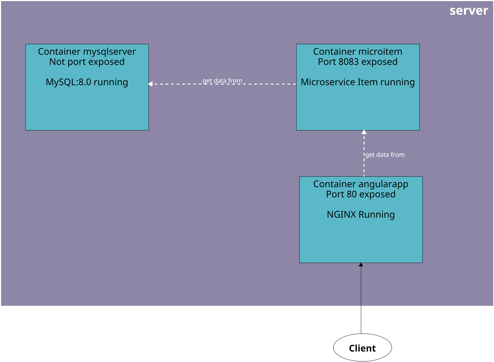
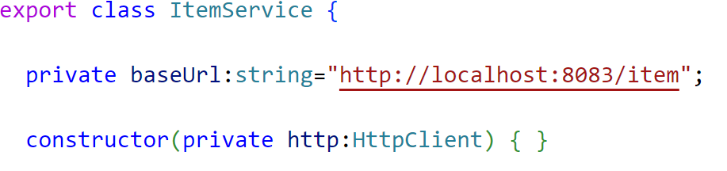
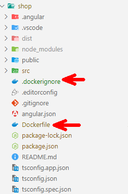
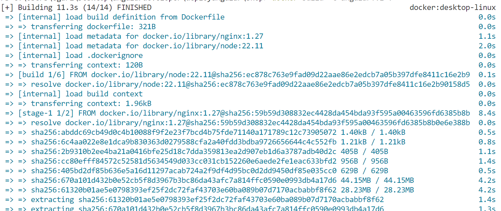
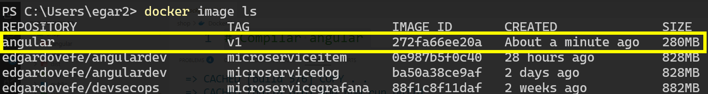
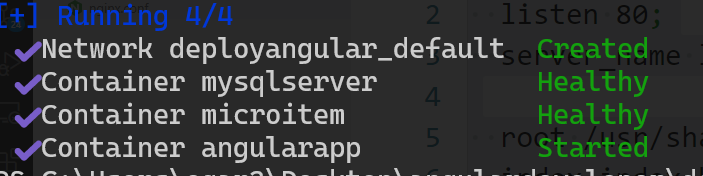
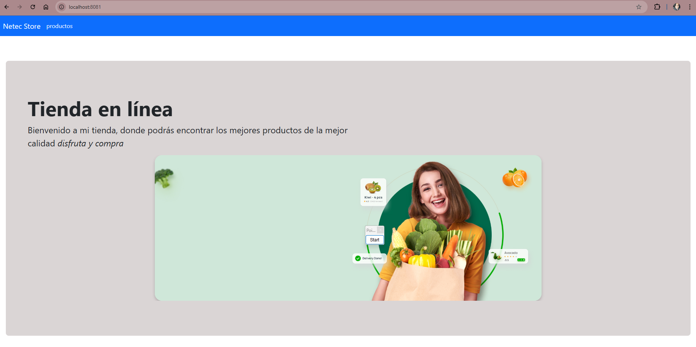

# Práctica 4. Despliegue de aplicación "ShoppingCart Angular en Docker"

Usando la tecnología de contenedores desplegaremos nuestra aplicación de Angular.

## Objetivos de la práctica:
- Modificar el código de Angular para contenedores.
- Configurar **Dockerfile** para la creación de la imagén de Angular.
- Crear la configuración de **Nginx**  para enrutar la aplicación de Angular. 
- Desplegar una aplicación usando **Docker Compose**.

## Duración aproximada:
- 90 minutos.
  
---

<div style="width: 400px;">
        <table width="50%">
            <tr>
                <td style="text-align: center;">
                    <a href="../Capitulo3/"></a>
                    <br>anterior
                </td>
                <td style="text-align: center;">
                   <a href="../README.md">Lista Laboratorios</a>
                </td>
<td style="text-align: center;">
                    <a href="../Capitulo5/"></a>
                    <br>siguiente
                </td>
            </tr>
        </table>
</div>

---

## Diagrama



## Instrucciones
> **IMPORTANTE:** Para esta práctica es importante tener la aplicación del **Lab3** y en la máquina tener **Docker** instalado. 

Esta práctica se encuentra dividida en las siguientes secciones: 

- **[Configuración App Angular](#configuración-app-angular-return)**
- **[Construir imagen de App Angular](#construir-imagen-de-app-angular-return)**
- **[Crear y configurar docker-compose y nginx](#crear-y-configurar-docker-compose-y-nginx-return)**
- **[Desplegar aplicación](#desplegar-aplicación-return)**

## Tarea 1. Configuración App Angular [return](#instrucciones)

> **IMPORTANTE:** Para prepara la aplicación de **shop** de angular necesitamos tener en cuenta que la app se conecta a un **microservicio** en Spring que al desarrollar se encuentra localmente, pero para lograr que funcione en contenedores debemos de cambiar la ruta de conexión. 

Paso 1. Abre la aplicación de **shop** en **Visual Studio Code**. 

Paso 2. Dirígete a los servicios de la aplicación y abre el servicio **item.service.ts**.



> **NOTA:** Si observamos el atributo **baseUrl**, esta para un microservicio que se ejecuta en **localhost** pero en un sistema en producción esto no es así. 

 Paso 3. Modifica el atributo **baseUrl** para poder usar un proxy que redirija el tráfico. 

```typescript
private baseUrl:string="/api/item";
```
 
> **IMPORTANTE:** Si observamos, cambiamos la ruta de localhost a una ruta relativa, esto nos servirá para que através del servidor nginx pueda redirigirse el tráfico al microservicio item. 

 Paso 4. Guardamos todo y nuestra aplicación ya esta lista.


## Tarea 2. Construir la imagen de App Angular [return](#instrucciones)

Paso 1. Para crear la imagen de **Docker** para nuestra aplicación crearemos los siguientes archivos en la raíz del proyecto **shop**: 

- **Dockerfile**: Es un archivo donde se indican las instrucciones del cómo se construira la imagen. 
- **.dockerignore**: En este archivo se declarán los archivos que no se agregarán en la imagen, es fundamental para hacer la imagen más ligera.


Paso 2. Contenido del archivo **.dockerignore** 

```text
node_modules
dist
.git
.gitignore
.angular
.vscode
Dockerfile
README.md
```

> **NOTA:** Se indican que archivos no se usarán para crear la imagen de Docker.

Paso 3. Contenido del archivo **Dockerfile**:

```Dockerfile
# Compilar angular
FROM node:22.11 AS build
WORKDIR /app
COPY package*.json ./
RUN npm install
COPY . .
RUN npm run build

# Ejecutar aplicación en nginx
FROM nginx:1.27
COPY --from=build /app/dist/shop /usr/share/nginx/html
EXPOSE 80
CMD ["nginx", "-g", "daemon off;"]
```

> **NOTA:** En este archivo se define que primero se construirá la aplicación y después se usará nginx para desplegar nuestra aplicación de Angular. 

Paso 4. Abre una terminal y posicionate en la ubicación del proyecto **shop** donde se encuentran el archivo **Dockerfile**.

Paso 5. Ejecuta el siguiente comando:

```bash
docker build -t angular:v1 .
```

> **NOTA:** La primera vez que ejecutes este comando tardará algunos minutos porque tiene que construir la aplicación de Angular para pasarla a Nginx. 



Paso 6. Valida con el siguiente comando si se creo la imagen de Docker: 

```bash
docker image ls
```




## Tarea 3. Crear y configurar docker-compose y nginx [return](#instrucciones)

Paso 1. En el escritorio, crea una nueva carpeta con el nombre de **composeAngular**.

Paso 2. En la carpeta **composeAngular** genera los siguientes archivo:

- **docker-compose.yaml**
- **nginx.conf**


Paso 3. En el archivo **docker-compose.yaml** agrega el siguiente contenido:

```yaml
services:
  mysqlserver:
    container_name: mysqlserver
    image: "mysql:8.0"
    environment:
      - MYSQL_ROOT_PASSWORD=netec123
      - MYSQL_DATABASE=items
    healthcheck:
      test: mysqladmin ping -uroot -p${MYSQL_ROOT_PASSWORD} -hlocalhost
  
  microitem:
    container_name: microitem
    image: edgardovefe/angulardev:microserviceitem
    environment:
      - IP_DB=mysqlserver
      - PORT_DB=3306
      - NAME_DB=items
      - USER_DB=root
      - PASSWORD_DB=netec123
    ports:
      - 8083:8083
    depends_on:
      mysqlserver:
        condition: service_healthy
    healthcheck:
      test: curl -f http://localhost:8083/item
    
  
  angularapp:
    container_name: angularapp
    image: "angular:v1"
    volumes:
      - "./nginx.conf:/etc/nginx/conf.d/default.conf"
    depends_on:
      microitem:
        condition: service_healthy
    ports:
      - 8081:80
```

Paso 4. En el archivo **nginx.conf** agrega el siguiente contenido: 

```nginx
server {
  listen 80;
  server_name localhost;

  root /usr/share/nginx/html/browser;
  index index.html;

  location / {
    try_files $uri $uri/ /index.html;
  }

  location /api/ {
    proxy_pass http://microitem:8083/;
  }
}
```


## Tarea 4. Desplegar aplicación [return](#instrucciones)

Paso 1. Abre una terminal en la carpeta **composeAngular** y ejecuta el siguiente comando: 

```bash
docker-compose up -d
```

> **NOTA:** El comando tardará unos minutos en crear toda la arquitectura para nuestra aplicación de angular. Pero al finalizar deberíamos de observar algo similar a la siguiente pantalla:




## Resultado esperado 

Si se ha llegado hasta aquí se debe de abrir un nuevo explorador web y abrir la ruta: http://localhost:8081, te debería de abrir tu aplicación de Angular desplegada en Docker. 


