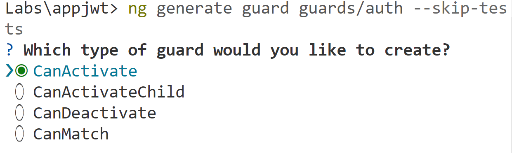

# 5. Autenticación de usuarios  usando JWT (Keycloak)
Se espera que el alumno pueda crear una aplicación de angular que pueda proteger algunos recursos usando **Guards** y un **Identity Provider**

## Objetivos
- Desplegar un identity provider usando **docker-compose**
- Crear una aplicación de angular
- Proteger recursos usando Guards
- Autenticar usuarios usando OpenId Connect con Keycloak

---
<div style="width: 400px;">
        <table width="50%">
            <tr>
                <td style="text-align: center;">
                    <a href="../Capitulo4/"></a>
                    <br>anterior
                </td>
                <td style="text-align: center;">
                   <a href="../README.md">Lista Laboratorios</a>
                </td>
<td style="text-align: center;">
                    <a href="../Capitulo6/"></a>
                    <br>siguiente
                </td>
            </tr>
        </table>
</div>

---

## Diagrama


## Instrucciones
Este laboratorio esta separado en las siguientes secciones: 

- **[Despliegue Identity Provider](#despliegue-identity-provider-return)**

- **[Configuración Identity Provider](#configuración-identity-provider-return)**

- **[Crear y configurar aplicación de angular](#crear-y-configurar-aplicación-de-angular-return)**

## Despliegue Identity Provider [return](#instrucciones)

> **IMPORTANTE:** Es importante tener docker instalado para esta sección. 

1. En el escritorio crear una carpeta que llamaremos **idpDeploy**
2. En la carpeta **idpDeploy** crearemos los siguientes archivos:

- **docker-compose.yaml**
- **keycloak.conf**

3. En el archivo **docker-compose.yaml** añadiremos el siguiente contenido: 

```yaml
services:
  keycloak:
    image: edgardovefe/angulardev:keycloak
    container_name: idp
    command: start-dev
    ports:
      - "8080:8080"
    environment:
      - KEYCLOAK_ADMIN=admin
      - KEYCLOAK_ADMIN_PASSWORD=pass
    volumes:
      - ./keycloak.conf:/opt/keycloak/conf/keycloak.conf
```

4. En el archivo **keycloak.conf** añadiremos el siguiente contenido: 

```properties
# Habilitar HTTP (modo dev)
http-enabled=true

# Habilitar el soporte CORS
cors=true
cors-allowed-methods=GET,POST,PUT,DELETE,OPTIONS
cors-allowed-headers=Authorization,Content-Type
cors-exposed-headers=Authorization,Content-Type
cors-max-age=3600
```

5. Abrir una terminal en la carpeta **idpDeploy** y ejecutar el siguiente comando: 

```bash
docker-compose up -d
```


6. Validar que el idp este iniciado con el siguiente comando:

```bash
docker ps
```


## Configuración identity provider [return](#instrucciones)

1. En tu explorador web abrir el siguiente url **http://localhost:8080** y te mostrará una página de login.


2. El usuario y password son los siguientes: 
 - **user**: admin
 - **password**: pass


3. Ahora crearemos un cliente para que nuestra aplicación de angular se pueda conectar:
    - En el menú lateral de keycloak entrar a **clients**

        

    - Ahora seleccionar el botón **Create client**

        

    - En **general settings** agregar la siguiente configuración:

        

    - En **Capability config** dejamos todo por default.

        


    - En **Login settings** añadiremos la siguiente configuración:

        


4. Para la siguiente sección debemos de recordar la siguiente información: 

- **URL Keycloak:** http://localhost:8080
- **Realm name:** master
- **Client name:** angularapp
- **User:** admin
- **Password:** pass
    

## Crear y configurar aplicación de angular [return](#instrucciones)

1. Abrir una terminal de windows en el escritorio y ejecutar el siguiente comando:

```bash
ng new appjwt
```
- **Stylesheet:** CSS
- **Server-Side Rendering:** No

2. Abrir la aplicación en **Visual Studio Code** 

3. Abrir la terminal de **VSCode** y ejecutar el siguiente comando: 

```bash
npm install keycloak-js
```

> **NOTA:** Este comando instala la librería necesaria para usar keycloak en Angular.

4. En la misma terminal crear los siguientes **componentes**: 

```bash
ng generate component components/home --skip-tests
```

```bash
ng generate component components/private --skip-tests
```

5. Crear un **servicio** con el siguiente comando: 

```bash
ng generate service services/keycloak --skip-tests
```

6. Crear un **guard** para proteger las rutas:

```bash
ng generate guard guards/auth --skip-tests 
```

> **IMPORTANTE:** Este comando nos preguntará el tipo de guard que usaremos para el caso de la aplicación usaremos **canActivate**.




7. Código del **servicio**  **keycloak.service.ts**:

```typescript
import { Injectable } from '@angular/core';
import Keycloak from 'keycloak-js';

@Injectable({
  providedIn: 'root'
})
export class KeycloakService {
  private keycloak: Keycloak;

  constructor() {
    /*inicializamos objeto de keycloak */
    this.keycloak = new Keycloak({
      url: 'http://localhost:8080',
      realm: 'master',
      clientId: 'angularapp'
    });
  }

  init(): Promise<void> {

    return this.keycloak?.init({
      onLoad: 'check-sso',
      silentCheckSsoRedirectUri: window.location.origin + '/silent-check-sso.html',
      checkLoginIframe: true
    }).then(() => {
      console.log('Keycloak initialized. Authenticated:', this.isLoggedIn());
    });
  }

  login(): void {
    this.keycloak.login({
      redirectUri: window.location.origin + '/private'
    });
  }

  authenticated(): boolean {
    return this.keycloak?.authenticated || false;
  }

  isLoggedIn(): boolean {
    return !!this.keycloak?.token;
  }

  getToken(): string | undefined {
    return this.keycloak?.token;
  }

  logout() {
    //this.keycloak?.logout();
    this.keycloak?.logout({
      redirectUri: window.location.origin + "/"
    })
  }

  getUserName() {
    return this.keycloak?.tokenParsed?.['preferred_username'];
  }

}
```

8. Ahora tenemos que configurar el archivo principal de angular para configurar el inicio de **keycloak** cuando la aplicación se inicie, modificar el archivo **main.ts**:

```typescript
import { bootstrapApplication } from '@angular/platform-browser';
import { appConfig } from './app/app.config';
import { AppComponent } from './app/app.component';
import { KeycloakService } from './app/services/keycloak.service';

/*bootstrapApplication(AppComponent, appConfig)
  .catch((err) => console.error(err));*/

 const keycloak = new KeycloakService();

 keycloak.init().then(()=>{
   bootstrapApplication(
    AppComponent, {providers:[
      ...(appConfig.providers ?? []),
      {provide: KeycloakService, useValue:keycloak}
    ]}
  )
 });
```

9. Configurar el **guard** de nuestro proyecto **auth.guard.ts**  con el siguiente código:

```typescript
import { inject } from '@angular/core';
import { CanActivateFn } from '@angular/router';
import { KeycloakService } from '../services/keycloak.service';

export const authGuard: CanActivateFn = (route, state) => {
  const keycloak = inject(KeycloakService);

  const isAuthenticated = keycloak.isLoggedIn();

  if (!isAuthenticated) {
    // Redirige al login de Keycloak
    keycloak.login();
    return false; // Bloquea navegación hasta que el usuario inicie sesión
  }

  return true;
};
```

10. Ahora configuraremos las rutas  en el archivo **app.routes.ts**

```typescript
import { Routes } from '@angular/router';
import { HomeComponent } from './components/home/home.component';
import { PrivateComponent } from './components/private/private.component';
import { authGuard } from './guards/auth.guard';

export const routes: Routes = [
    {path:'', component:HomeComponent},
    {path:'private', component:PrivateComponent, canActivate:[authGuard]}
];
```

> **NOTA:** En este archivo nosotros configuraremos las rutas que serán protegidas por la autenticación de keycloak, en este caso el componente **Private** estará protegido por authGuard

11. Agregar boostrap en el archivo **index.html**

```html
<!doctype html>
<html lang="en">
<head>
  <meta charset="utf-8">
  <title>Appjwt</title>
  <base href="/">
  <meta name="viewport" content="width=device-width, initial-scale=1">
  <link rel="icon" type="image/x-icon" href="favicon.ico">
  
  <!--link bootstrap-->
  <link href="https://cdn.jsdelivr.net/npm/bootstrap@5.3.6/dist/css/bootstrap.min.css" rel="stylesheet" integrity="sha384-4Q6Gf2aSP4eDXB8Miphtr37CMZZQ5oXLH2yaXMJ2w8e2ZtHTl7GptT4jmndRuHDT" crossorigin="anonymous">
</head>
<body>
  <app-root></app-root>

<!--script bootstrap-->
<script src="https://cdn.jsdelivr.net/npm/bootstrap@5.3.6/dist/js/bootstrap.bundle.min.js" integrity="sha384-j1CDi7MgGQ12Z7Qab0qlWQ/Qqz24Gc6BM0thvEMVjHnfYGF0rmFCozFSxQBxwHKO" crossorigin="anonymous"></script>
</body>
</html>
```

12. Modificar el componente **app.component**

**app.component.ts**
```typescript
import { Component, inject } from '@angular/core';
import { RouterLink, RouterOutlet } from '@angular/router';
import { KeycloakService } from './services/keycloak.service';

@Component({
  selector: 'app-root',
  imports: [RouterOutlet, RouterLink],
  templateUrl: './app.component.html',
  styleUrl: './app.component.css'
})
export class AppComponent {
  title = 'appjwt';
  private keycloakService= inject(KeycloakService);

  logout(){
    this.keycloakService.logout();
  }
}

```

**app.component.html**
```html
<nav class="navbar navbar-expand-lg navbar-dark bg-primary">
  <div class="container-fluid">
    <a class="navbar-brand" routerLink="/">Netec</a>
    <button
      class="navbar-toggler"
      type="button"
      data-bs-toggle="collapse"
      data-bs-target="#navbarContent"
      aria-controls="navbarContent"
      aria-expanded="false"
      aria-label="Toggle navigation">
      <span class="navbar-toggler-icon"></span>
    </button>

    <div class="collapse navbar-collapse" id="navbarContent">
      <ul class="navbar-nav me-auto mb-2 mb-lg-0">
        <li class="nav-item">
          <a class="nav-link" routerLink="/">Home</a>
        </li>
        <li class="nav-item">
          <a class="nav-link" routerLink="/private" >Private</a>
        </li>
      </ul>
      <button class="btn btn-outline-light" (click)="logout()">Logout</button>
    </div>
  </div>
</nav>

<router-outlet></router-outlet>

```


13. Modificar el component **home.component**

**home.component.ts**
```typescript
import { Component } from '@angular/core';

@Component({
  selector: 'app-home',
  imports: [],
  templateUrl: './home.component.html',
  styleUrl: './home.component.css'
})
export class HomeComponent {

}

```


**home.component.html**
```html
<div class="container mt-5">
  <div class="text-center mb-5">
    <h1 class="display-4 fw-bold text-primary">Bienvenido a Netec</h1>
    <p class="lead text-secondary">Formación en tecnología para transformar tu futuro profesional</p>
  </div>

  <div class="row align-items-center mb-5">
    <div class="col-md-6">
      <h2 class="fw-bold">¿Quiénes somos?</h2>
      <p>
        Somos una empresa dedicada a impartir cursos de programación, cloud, seguridad y desarrollo profesional.
        Nuestros instructores son expertos en la industria y nuestras capacitaciones están alineadas con las
        necesidades reales del mercado.
      </p>
      <a class="btn btn-primary mt-3" routerLink="/private">Explora nuestros cursos</a>
    </div>
    <div class="col-md-6 text-center">
      
    </div>
  </div>

  <div class="row text-center">
    <div class="col-md-4 mb-4">
      <div class="card h-100 shadow-sm">
        <div class="card-body">
          <h5 class="card-title text-primary">Cursos Actualizados</h5>
          <p class="card-text">Contenido alineado con las últimas tecnologías y certificaciones del mercado.</p>
        </div>
      </div>
    </div>
    <div class="col-md-4 mb-4">
      <div class="card h-100 shadow-sm">
        <div class="card-body">
          <h5 class="card-title text-primary">Instructores Expertos</h5>
          <p class="card-text">Aprende de profesionales con experiencia real en la industria.</p>
        </div>
      </div>
    </div>
    <div class="col-md-4 mb-4">
      <div class="card h-100 shadow-sm">
        <div class="card-body">
          <h5 class="card-title text-primary">Acceso 24/7</h5>
          <p class="card-text">Accede a los materiales en cualquier momento y desde cualquier lugar.</p>
        </div>
      </div>
    </div>
  </div>
</div>

```

14. Modificar el componente **private.component**

**private.component.ts**
```typescript
import { Component, inject, Inject, signal } from '@angular/core';
import { KeycloakService } from '../../services/keycloak.service';

@Component({
  selector: 'app-private',
  imports: [],
  templateUrl: './private.component.html',
  styleUrl: './private.component.css'
})
export class PrivateComponent {
  private service= inject(KeycloakService);
  nameUser=signal<string>("");

  constructor(){
     this.nameUser.set(this.service.getUserName()??"");
  }

}
```

**private.component.html**
```html
<div class="container-fluid mt-4">
  <div class="row mb-4">
    <div class="col">
      <h2 class="fw-bold text-primary">Bienvenido {{nameUser()}} al Panel de Administración</h2>
      <p class="text-muted">Gestiona el contenido y los usuarios de la plataforma</p>
    </div>
  </div>

  <div class="row g-4">
    <!-- Tarjetas de acceso rápido -->
    <div class="col-md-4">
      <div class="card shadow-sm h-100">
        <div class="card-body text-center">
          <h5 class="card-title">Usuarios</h5>
          <p class="card-text">Ver, editar y eliminar usuarios registrados</p>
          <button class="btn btn-outline-primary">Administrar usuarios</button>
        </div>
      </div>
    </div>

    <div class="col-md-4">
      <div class="card shadow-sm h-100">
        <div class="card-body text-center">
          <h5 class="card-title">Cursos</h5>
          <p class="card-text">Agregar o modificar cursos disponibles</p>
          <button class="btn btn-outline-primary">Administrar cursos</button>
        </div>
      </div>
    </div>

    <div class="col-md-4">
      <div class="card shadow-sm h-100">
        <div class="card-body text-center">
          <h5 class="card-title">Reportes</h5>
          <p class="card-text">Estadísticas de acceso y rendimiento</p>
          <button class="btn btn-outline-primary">Ver reportes</button>
        </div>
      </div>
    </div>
  </div>

  <!-- Tabla simulada -->
  <div class="row mt-5">
    <div class="col">
      <h4 class="mb-3">Últimos usuarios registrados</h4>
      <table class="table table-hover table-bordered">
        <thead class="table-light">
          <tr>
            <th>#</th>
            <th>Nombre</th>
            <th>Correo</th>
            <th>Rol</th>
            <th>Acciones</th>
          </tr>
        </thead>
        <tbody>
          <tr>
            <td>1</td>
            <td>Ana López</td>
            <td>ana&#64;example.com</td>
            <td>Estudiante</td>
            <td>
              <button class="btn btn-sm btn-warning me-1">Editar</button>
              <button class="btn btn-sm btn-danger">Eliminar</button>
            </td>
          </tr>
          <tr>
            <td>2</td>
            <td>Carlos Ruiz</td>
            <td>carlos&#64;example.com</td>
            <td>Instructor</td>
            <td>
              <button class="btn btn-sm btn-warning me-1">Editar</button>
              <button class="btn btn-sm btn-danger">Eliminar</button>
            </td>
          </tr>
        </tbody>
      </table>
    </div>
  </div>
</div>


```

15. Ahora guardamos todo y ejecutamos el siguiente comando: 

```bash
ng serve
```

## Resultado Esperado [Instrucciones](#instrucciones)

Si hemos llegado hasta aquí abrimos el explorador web en la ruta http://localhost:4200


En la barra de navegación abrimos la opcíon **private** y nos pedira iniciar sesión desde la página de keycloak. 
- **username:** admin
- **password:** pass


Si el login es correcto debería de mostrarte el panel de administración de nuestra página web. 

