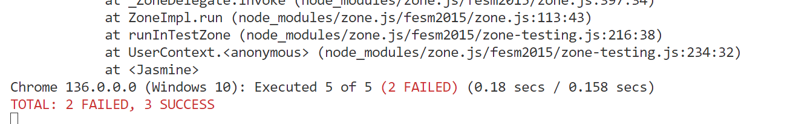

# Práctica 6. Pruebas de código usando Jasmine y Karma
El alumno aprenderá a realizar pruebas de código para validar el funcionamiento de un componente en Angular.

## Objetivos de la práctica:
- Definir validaciones en formularios.
- Crear pruebas de código usando Jasmine y Karma.
- Ejecutar las pruebas de código.

## Duración aproximada:
- 60 minutos.
  
---

<div style="width: 400px;">
        <table width="50%">
            <tr>
                <td style="text-align: center;">
                    <a href="../Capitulo5/"></a>
                    <br>anterior
                </td>
                <td style="text-align: center;">
                   <a href="../README.md">Lista Laboratorios</a>
                </td>
<td style="text-align: center;">
                    <a href="../Capitulo7/"></a>
                    <br>siguiente
                </td>
            </tr>
        </table>
</div>

---


## Diagrama
Al final de la práctica se espera que el alumno pueda observar la ejecución de las pruebas unitarias de la aplicación de Angular.


## Instrucciones
1. Abre una terminal en el escritorio.
2. Ejecuta el siguiente comando para la creación de un nuevo proyecto en Angular:

```bash
ng new apptesting
```

- **Stylesheet:** CSS
- **Server Side Rendering:** No

3. Abre el  proyecto en **Visual Studio Code**. 

4. Abre una terminal en **Visual Studio Code** y crea un nuevo componente con el siguiente comando:

```bash
ng generate component components/robust-form
```

5. Modifica las **rutas** de Angular:

```typescript
import { Routes } from '@angular/router';
import { RobustFormComponent } from './components/robust-form/robust-form.component';

export const routes: Routes = [
    {path:"", component:RobustFormComponent}
];
```

6. Modifica el código del componente principal:

**app.component.ts**
```typescript
import { Component } from '@angular/core';
import { RouterLink, RouterOutlet } from '@angular/router';

@Component({
  selector: 'app-root',
  imports: [RouterOutlet,RouterLink],
  templateUrl: './app.component.html',
  styleUrl: './app.component.css'
})
export class AppComponent {
  title = 'apptesting';
}
```

**app.component.html**
```html
<nav class="navbar bg-primary">
  <div class="container-fluid">
    <a class="navbar-brand" style="color: aliceblue;" routerLink="/">Netec</a>
  </div>
</nav>

<router-outlet></router-outlet>
```

7. Modifica el código del componente **robust-form**:

**robust-form.component.ts**
```typescript
import { Component, inject, signal } from '@angular/core';
import { FormBuilder, FormGroup, ReactiveFormsModule, Validators } from '@angular/forms';
import { HttpClient } from '@angular/common/http';

@Component({
  selector: 'app-robust-form',
  standalone:true,
  imports:[ReactiveFormsModule],
  templateUrl: './robust-form.component.html'
})
export class RobustFormComponent {

  private fb=inject(FormBuilder);
  private http=inject(HttpClient);

  form = this.fb.group({
      name: ['', Validators.required],
      email: ['', [Validators.required, Validators.email]],
      age: [0, [Validators.required, Validators.min(18), Validators.max(65)]]
  });
  submitted = signal<boolean>(false);
  serverError = signal<string>('');


  submitForm() {
    this.submitted.set(true);
    this.serverError.set('');

    if (this.form.valid) {
      this.http.post('https://pokeapi.co/api/v2/', this.form.value).subscribe({
        next: res => console.log('Form submitted successfully', res),
        error: err => this.serverError.set('Server failed. Try again later.')
      });
    }
  }
}  

```

**robust-form.component.html**
```html
<form [formGroup]="form" (ngSubmit)="submitForm()" class="container mt-4">

  <div class="mb-3">
    <label for="name" class="form-label">Nombre:</label>
    <input id="name" type="text" class="form-control" formControlName="name"
           [class.is-invalid]="submitted() && form.controls['name'].invalid" />
    @if (submitted() && form.controls['name'].invalid) {
      <div class="invalid-feedback">Nombre es requerido.</div>
    }
  </div>

  <div class="mb-3">
    <label for="email" class="form-label">Email:</label>
    <input id="email" type="email" class="form-control" formControlName="email"
           [class.is-invalid]="submitted() && form.controls['email'].invalid" />
    @if (submitted() && form.controls['email'].invalid) {
      <div class="invalid-feedback">Email inválido.</div>
    }
  </div>

  <div class="mb-3">
    <label for="age" class="form-label">Edad:</label>
    <input id="age" type="number" class="form-control" formControlName="age"
           [class.is-invalid]="submitted() && form.controls['age'].invalid" />
    @if (submitted() && form.controls['age'].invalid) {
      <div class="invalid-feedback">Edad debe estar entre 18 y 65.</div>
    }
  </div>

  @if (serverError()) {
    <div class="alert alert-danger">{{ serverError() }}</div>
  }

  <button type="submit" class="btn btn-primary">Enviar</button>
</form>

```

**robust-form.component.spect.ts**
```typescript
import { ComponentFixture, TestBed } from '@angular/core/testing';
import { provideHttpClientTesting, HttpTestingController } from '@angular/common/http/testing';
import { RobustFormComponent } from './robust-form.component';
import { provideHttpClient } from '@angular/common/http';


describe('RobustFormComponent', () => {
  let component: RobustFormComponent;
  let fixture: ComponentFixture<RobustFormComponent>;
  let httpMock: HttpTestingController;

  beforeEach(async () => {
    await TestBed.configureTestingModule({
      imports: [RobustFormComponent],
      providers: [provideHttpClientTesting(),
        provideHttpClient()
      ]
    }).compileComponents();

    fixture = TestBed.createComponent(RobustFormComponent);
    component = fixture.componentInstance;
    httpMock = TestBed.inject(HttpTestingController);
    fixture.detectChanges();
  });

  afterEach(() => {
    httpMock.verify();
  });

  it('should create the form with 3 controls', () => {
    expect(component.form.contains('name')).toBeTruthy();
    expect(component.form.contains('email')).toBeTruthy();
    expect(component.form.contains('age')).toBeTruthy();
  });

  it('should mark name as invalid if empty', () => {
    const control = component.form.get('name');
    control?.setValue('');
    expect(control?.valid).toBeFalse();
  });

  it('should show error message if server fails', () => {
    component.serverError.set('Server failed.');
    fixture.detectChanges();
    const compiled = fixture.nativeElement as HTMLElement;
    expect(compiled.textContent).toContain('Server failed.');
  });

  it('should send form data on valid submission', () => {
    component.form.setValue({ name: 'Juan', email: 'juan@test.com', age: 30 });
    component.submitForm();

    const req = httpMock.expectOne('https://pokeapi.co/api/v2/');
    expect(req.request.method).toBe('POST');
    expect(req.request.body).toEqual({ name: 'Juan', email: 'juan@test.com', age: 30 });

    req.flush({ message: 'Success' });
  });

  it('should handle server error', () => {
    component.form.setValue({ name: 'Ana', email: 'ana@test.com', age: 25 });
    component.submitForm();

    const req = httpMock.expectOne('https://pokeapi.co/api/v2/');
    req.flush('Error', { status: 500, statusText: 'Server Error' });

    expect(component.serverError()).toBe('Server failed. Try again later.');
  });
});

```

8. Ejecuta el proyecto con el siguiente comando: 

```bash
ng serve
```

9. Deberíamos de observar la siguiente aplicación:


10. Prueba las validaciones:


11. Deten la aplicación **(cerrar terminal donde se ejecuta la aplicación)**.

12. Ejecuta las pruebas con el siguiente comando:

```bash
ng test
```




## Resultado esperado [Instrucciones](#instrucciones)

Al ejecutar las pruebas nos abrirá una pagina de un navegador web donde nos indicará cuantas pruebas fuerón correctas. 


