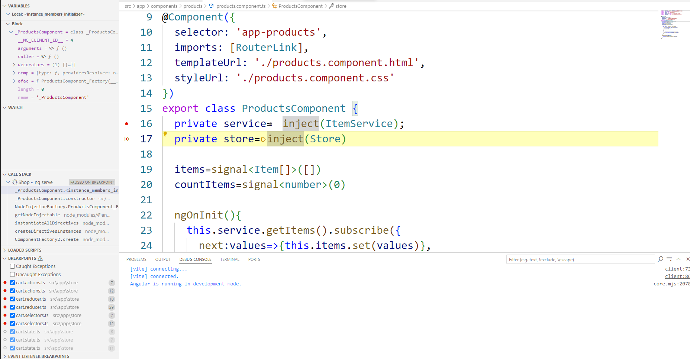
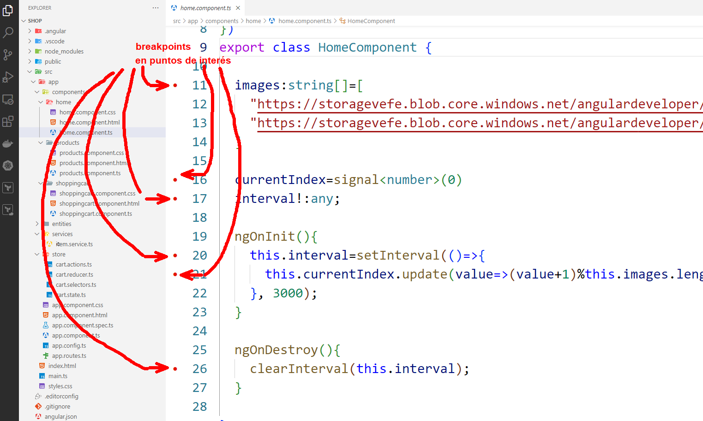
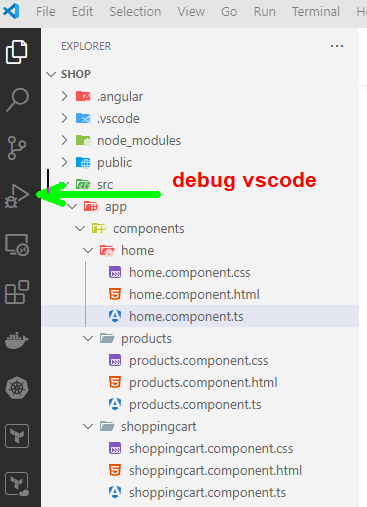
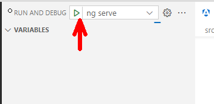
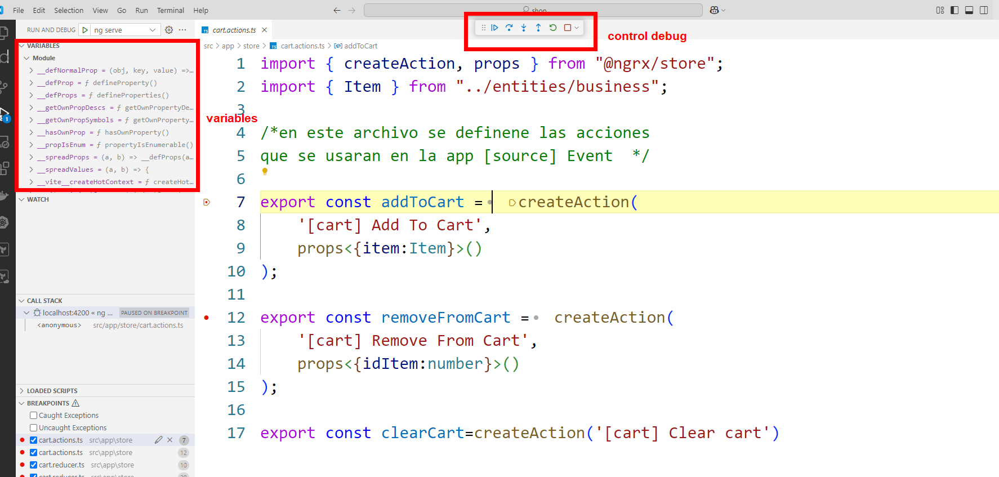

# Práctica 7. Depuración de la aplicación de Angular usando Visual Studio Code

En este laboratorio usaremos las herramientas de depuración de código para válidar el funcionamiento y flujo de ejecución de una aplicación de Angular. 

## Objetivos de la práctica:
- Depurar código de Angular.
- Usar el debug de Visual Studio.

## Duración aproximada:
- 30 minutos.

---

        <table width="50%">
            <tr>
                <td style="text-align: center;">
                    
                     anterior
                </td>
                <td style="text-align: center;">
                   <a href="../README.md">Lista Laboratorios</a>
                </td>
<td style="text-align: center;">
                    
                     siguiente
                </td>
            </tr>
        </table>

---

## Diagrama
Al final de la práctica el alumno podrá observar el proceso de depuración que ofrece Visual Studio Code.

## Instrucciones
1. Abre cualquier aplicación de Angular en **Visual Studio Code**.

> **IMPORTANTE:** Este proceso que aprenderemos será útil para cualquier aplicación de Angular. Nos da la posibilidad de encontrar errores de cualquier flujo, incluso, nos permite entender el proceso de ejecución de nuestra aplicación. 

2. Dentro del proyecto de Angular vamos a agregar breakpoints. 

> **NOTA:** Los breakpoins son herramientas que permiten detener la ejecución de un programa en una línea específica de código durante la depuración. Esto permite que podamos inspeccionar variables, ver el flujo del programa y encontrar errores de manera más efectiva. 

3. Se recomienda agregar los breakpoints en puntos importantes de nuestro código, cómo por ejemplo: **variables dentro de un componente, funciones, servicios** y esto permitirá que podamos ver el flujo de ejecución de nuestro programa. 

4. Para este ejemplo utiliza la aplicación de **shop** que realizamos en el tema **3 y 4**, agrega breakpoints en las variables que estan en los componentes: 

5. Selecciona los puntos de interés dentro de tu aplicación. 

6. Después, selecciona la opción de depuración de **Visual Studio Code**.

7. Iniciar la depuración:

8. Al iniciar la depuración nos abrirá el menú de depuración de VSCode, donde podremos controlar la ejecución de cada breakpoint.

9. A este proceso se le conoce cómo depuración y en la mayoría de los editores de código podremos encontrar herramientas similares. 

## Resultado esperado [Instrucciones](#instrucciones)

Si hemos llegado hasta aquí deberíamos observar la herramienta de depuración en ejecución. 

