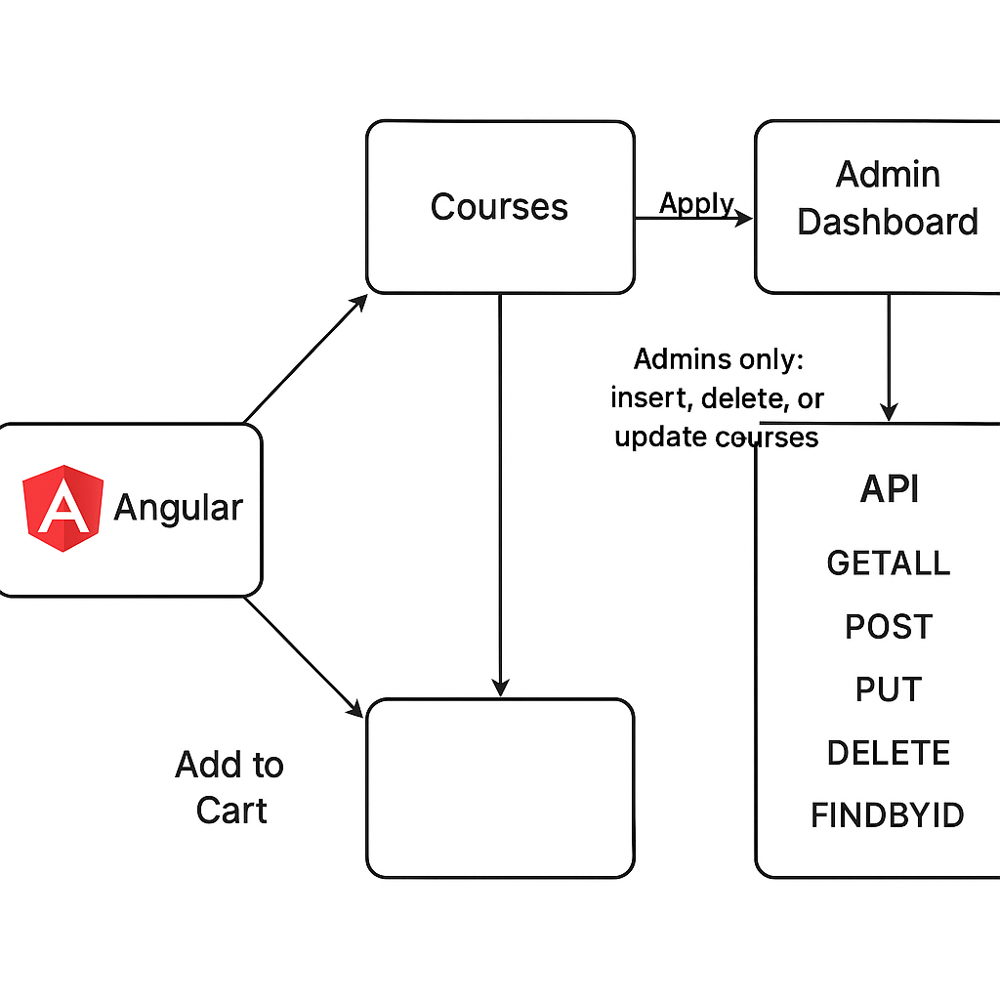

# Práctica 8. Proyecto final
La empresa Netec necesita crear un frontend con Angular que le permita mostrar cursos a sus clientes. Pero requiere un dashboard de administradores que sólo se active si inicias sesión con alguna cuenta de usuario. 
La empresa Netec ya tiene un API de cursos que cuentan con los siguientes métodos: GETALL, POST, PUT, DELETE, FINDBYID.

## Objetivos de la práctica:
- Desplegar API Spring Boot.
- Crear una aplicación de Angular.
- Desplegar la aplicación usando **Docker**.
- Válidar el funcionamiento de la aplicación.

## Duración aproximada:
- 240 minutos.

---

<div style="width: 400px;">
        <table width="50%">
            <tr>
                <td style="text-align: center;">
                    <a href="../Capitulo7/"></a>
                    <br>anterior
                </td>
                <td style="text-align: center;">
                   <a href="../README.md">Lista Laboratorios</a>
                </td>
<td style="text-align: center;">
                    <a href="../Capitulo9/"></a>
                    <br>siguiente
                </td>
            </tr>
        </table>
</div>


---


## Diagrama




## Instrucciones

Los requerimientos son los siguientes: 

- Se necesita que el alumno despliegue el API de Spring Boot que usaremos en el curso usando el siguiente **docker-compose.yaml**.

```yaml
services:
  mysqlserver:
    container_name: mysqlserver
    image: "mysql:8.0"
    environment:
      - MYSQL_ROOT_PASSWORD=netec123
      - MYSQL_DATABASE=items
    healthcheck:
      test: mysqladmin ping -uroot -p${MYSQL_ROOT_PASSWORD} -hlocalhost
  
  microcourse:
    container_name: microcourse
    image: edgardovefe/angulardev:microservicecourse
    environment:
      - IP_DB=mysqlserver
      - PORT_DB=3306
      - NAME_DB=items
      - USER_DB=root
      - PASSWORD_DB=netec123
    ports:
      - 8084:8084
    depends_on:
      mysqlserver:
        condition: service_healthy
```

2. Los métodos disponibles en el API son los siguientes: 

**Base URL:** `/course`  
**Formato:** JSON  
**CORS:** Habilitado para cualquier origen (`@CrossOrigin(origins = "*")`)

---

## 📌 Endpoints Disponibles

---

### 🔹 GET `/course`

**Descripción:**  
Obtiene todos los cursos disponibles.

**Respuesta:**
- `200 OK` – Devuelve una lista de objetos `Course`.

---

### 🔹 GET `/course/{id}`

**Descripción:**  
Obtiene un curso específico por su ID.

**Parámetros:**
- `id` (path) – Identificador único del curso.

**Respuestas:**
- `200 OK` – Devuelve el curso solicitado.
- `404 Not Found` – Si no se encuentra el curso.
- `500 Internal Server Error` – Si ocurre un error inesperado.

---

### 🔹 POST `/course`

**Descripción:**  
Inserta un nuevo curso en el sistema.

**Body:**
```json
{
		"name": "Angular Developer",
		"description": "Curso de angular usando la versión 19",
		"duration": "35 horas",
		"level": "Intermedio",
		"price": 1000
}
```

**Respuestas:**
- `201 Created` – Curso creado correctamente.
- `500 Internal Server Error` – Error al insertar el curso.

---

### 🔹 PUT `/course`

**Descripción:**  
Actualiza los datos de un curso existente.

**Body:**
```json
{
		"id": 1,
		"name": "Angular Developer",
		"description": "Curso de angular usando la versión 19",
		"duration": "35 horas",
		"level": "Intermedio",
		"price": 1000
}
```

**Respuestas:**
- `200 OK` – Curso actualizado con éxito.
- `404 Not Found` – Curso no encontrado.
- `500 Internal Server Error` – Error al actualizar el curso.

---

### 🔹 DELETE `/course/{id}`

**Descripción:**  
Elimina un curso existente por su ID.

**Parámetros:**
- `id` (path) – ID del curso a eliminar.

**Respuestas:**
- `200 OK` – Curso eliminado correctamente.
- `404 Not Found` – Curso no encontrado.
- `500 Internal Server Error` – Error al eliminar el curso.
---


4. Se requiere que el alumno proponga un diseño que permita lo siguiente: 

- Página publica que permita observar los cursos sin la necesidad de iniciar sesión. 

- Tendrá un apartado donde le pedirá iniciar sesión y se activará un dashboard donde le permitirá sólo a los usuarios autenticados administrar los cursos. 

- Puede usar angular material o bootstrap para crear el diseño. 

- Al terminar se debe de desplegar la aplicación en **Docker** debe crear la imagen y en el mismo **docker-compose.yaml** donde se desplega el api, agregar el despliegue de la aplicación de **Angular**. 


